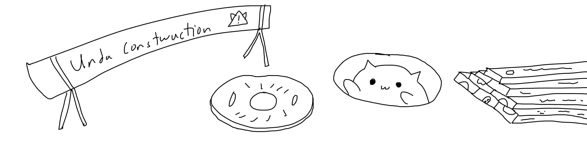

# Sensored
A simple very dense sensor module which includes an IMU and an environmental sensor. The system is designed to be easily integrated with any other projects and is relatively cheap to fabricate.

## Features
* IMU: ICM20948 (3 Axis Accelerometer + 3 Axis Gyroscope + 3 Axis Magnetometer)
* ENV: BME280 (Temperature + Humidity + Pressure)

## [Software](/Software/README.md)
There is CURRENTLY NO DRIVERS for these as I have not fabricated them yet, however once I do I'll work on it then.

## [Embedded](/Embedded/README.md)
There is CURRENTLY NO DOCUMENTATION in this section yet as I have not verified the circuit board and have not tested it yet.

## Roadmap
* Work In Progress: Fabricating V1.0
* Planned: Add Software Support