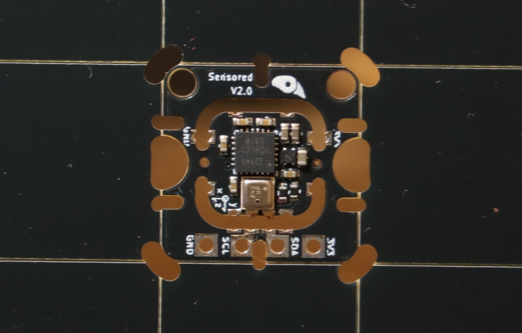

# Sensored
A simple very dense sensor module which includes an IMU and an environmental sensor. The system is designed to be easily integrated with any other projects and is relatively cheap to fabricate.

## Features
* IMU: ICM20948 (3 Axis Accelerometer + 3 Axis Gyroscope + 3 Axis Magnetometer)
* ENV: BME280 (Temperature + Humidity + Pressure)
* I2C: Internally Pulled Up 10K
* LDO: 3V3 input power is stepped down to 1.8v for other IC functions

## [Embedded](/Embedded/README.md)
The Sensored board integrates two key devices: the ICM20948, a 9-axis motion sensor, and the BME280 for environmental monitoring. Designed for direct integration onto host boards, it operates on 3.3 V with onboard regulation for the IMU, providing a compact foundation for motion and environmental sensing in embedded systems.

## Roadmap
* Milestones: Fabricating V1.0
* Milestones: Confirmed V1.0 circuit design
* Milestones: Fabricating V2.0
* Milestones: Confirmed V2.0 circuit design